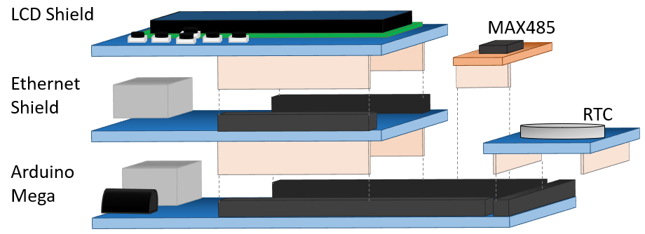
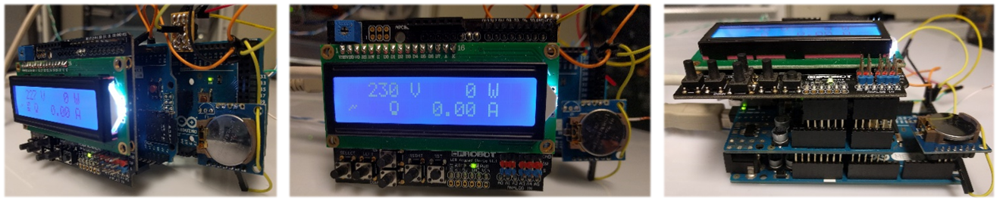

# V2R
Virtual to Reality (V2R) device is an energy analyser emulator that can be used to simulate, emulate and mirror energy resources.
It uses an Arduino Mega and some shields to provide an easy to build solution.

You can see it working in: 
* Luis Gomes, Zita Vale “Virtual to Reality Emulator for Electrical Loads”, in Proceedings of the Third DREAM-GO Workshop – Intelligent load management in local and wholesale demand response markets, 23-24 January, Porto, Portugal, 2018. Doi: [10.5281/zenodo.2677528](www.doi.org/10.5281/zenodo.2677528);
*	Luis Gomes, Omid Abrishambaf, Pedro Faria, Zita Vale “Retrofitting Approach for an Automated Load Testbed”, in Proceedings of the Final ELECON workshop – Dissemination & Transfer of Knowledge, 12-14 September, Florianópolis, Brazil, 2016;
*	Luis Gomes, Pedro Faria, Zita Vale, Jorge Silva, "Energy Analyzer Emulator for Microgrid Implementation and Demonstration and Respective Gateway" in IEEE Transactions on Industry Applications, vol. 55, no. 1, pp. 134-144, Jan.-Feb. 2019. Doi: [10.1109/TIA.2018.2866451](www.doi.org/10.1109/TIA.2018.2866451);
*	Luis Gomes, Zita Vale “Energy Analyzer Emulation for Energy Management Simulators”, in: Omatu S., Rodríguez S., Villarrubia G., Faria P., Sitek P., Prieto J. (eds) Distributed Computing and Artificial Intelligence, 14th International Conference. DCAI 2017. Advances in Intelligent Systems and Computing, vol 620. Springer, Cham. Doi: [10.1007/978-3-319-62410-5_26](www.doi.org/10.1007/978-3-319-62410-5_26).

## Needed hardware

## Final look

